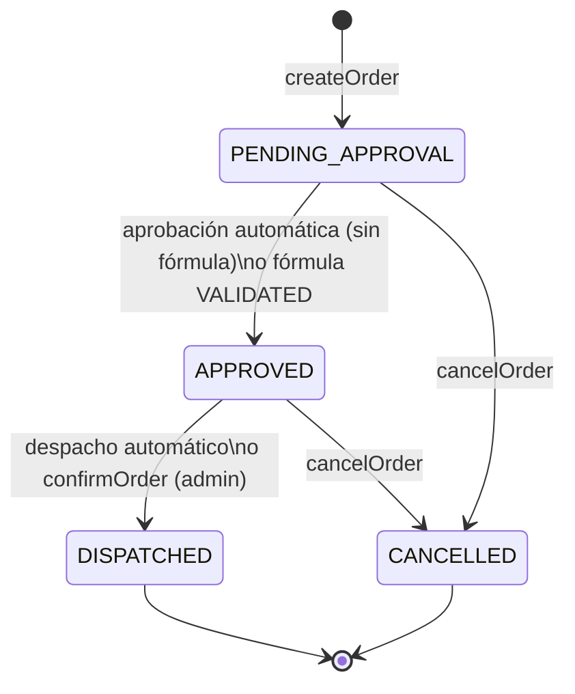

# Cambios del 25-09-2026: puesta en marcha y flujo de órdenes

Este documento resume lo que se corrigió en el proyecto **Afirmative Pill** después de revisar el código contra `planning.md`. Explica qué estaba mal, qué se cambió y por qué, y cómo levantar y probar el backend ahora.

> **Estado:** el backend compila, arranca y el flujo de órdenes funciona de punta a punta (verificado, ver [Verificación](#6-verificación)). El frontend todavía no usa las mutations ni la subscription, y la documentación general (README, INSTRUCCIONES, ENTREGAS_FINALES) aún no refleja estos cambios. Ver [Pendientes](#7-pendientes).

---

## 1. Problemas encontrados

Estos problemas impedían instalar, arrancar o usar el backend:

| # | Problema | Efecto |
|---|---|---|
| 1 | `backend/package.json` declaraba `@apollo/server/express4` como dependencia. Es una ruta de importación, no un paquete. | `npm install` fallaba. |
| 2 | El `.env` estaba en la raíz, pero el backend lo busca en `backend/`. Además tenía la URL y las claves del **storage S3** de Supabase, no las de la API. | El backend no podía conectarse a la base. |
| 3 | No existía `.gitignore`. | Riesgo de subir credenciales y `node_modules`. |
| 4 | Supabase se había iniciado desde otra carpeta y la base estaba vacía: el DDL nunca se ejecutó. | Todas las consultas fallaban con "relation does not exist". |
| 5 | La vista `medication_summary` no incluía `active_ingredient`. | La búsqueda del catálogo fallaba. |
| 6 | El usuario simulado tenía id `'paciente-de-ejemplo-id'`, que no es un UUID ni existía en `patients`. | **Ninguna orden se podía crear.** |
| 7 | `createOrder` rechazaba toda orden con medicamentos formulados, y `submitPrescriptionEvidence` exigía que la orden ya los tuviera. | El flujo de fórmula médica era un callejón sin salida (33 de 50 medicamentos requieren fórmula). |
| 8 | Crear una orden eran varias llamadas separadas sin transacción. | Un fallo a mitad dejaba órdenes huérfanas o stock descontado sin orden. |
| 9 | Nada movía las órdenes de `PENDING_APPROVAL`, y `confirmOrder` comparaba contra un admin inexistente. | Las órdenes nunca avanzaban y la subscription nunca notificaba nada. |
| 10 | 66 errores de TypeScript. `npm run build` tampoco copiaba `schema.graphql` a `dist/`. | `npm run build` y `npm start` fallaban. |
| 11 | `supabase-js` en su versión actual exige WebSocket nativo (Node 22+). | El servidor no arrancaba en Node 18–20. |
| 12 | Los errores internos devolvían un `ValidationError` que la union no sabía resolver. | Aparecía un error de GraphQL en vez del payload tipado. |
| 13 | El frontend no tenía `tsconfig.json`. | Los imports `@/...` no resolvían. |

---

## 2. Infraestructura y configuración

### Supabase vinculado al repositorio

Supabase ahora vive dentro del repo, en la carpeta `supabase/`:

```
supabase/
├── config.toml                                   # proyecto "Taller3-Patrones"
├── migrations/
│   ├── 20260925000000_init_schema.sql            # tablas, índices, vista, funciones base
│   └── 20260925000100_order_commands.sql         # comandos transaccionales de órdenes
└── seed.sql                                      # 10 categorías, 50 medicamentos, paciente demo
```

`supabase start` (la primera vez) o `supabase db reset` (en cualquier momento) crean el esquema y cargan los datos. Ya no hace falta pegar SQL en Studio.

- `seed.sql` se generó a partir de `scripts/medications_dataset.csv`.
- El paciente demo tiene un UUID fijo: `00000000-0000-0000-0000-000000000001`. En el backend es la constante `DEMO_PATIENT_ID` de `backend/src/context.ts`.
- `scripts/supabase_ddl.sql` recibió la misma corrección de la vista, para no quedar desincronizado. La fuente de verdad ahora son las migraciones.

### Variables de entorno

- El `.env` ahora está en `backend/.env` y se genera con los valores de `supabase status -o env`. La variable `SUPABASE_URL` debe ser `http://127.0.0.1:54321`.
- Se eliminó el `.env` de la raíz.
- El nuevo `.gitignore` excluye `.env*` (salvo `.env.example`), `node_modules`, `dist` y `.next`.

### Otros

- Se eliminó la dependencia inválida de `backend/package.json` y se agregó `@types/cors`. `npm run build` ahora ejecuta `tsc && cp -r src/schema dist/`.
- Se agregó `backend/package-lock.json`.
- Se agregó `frontend/tsconfig.json`, con el alias `@/*`.
- `backend/src/datasources/supabaseClient.ts` le pasa `ws` como transporte a `supabase-js`, así el backend funciona desde Node 18.

---

## 3. Nuevo flujo de órdenes (CQRS y dominio)

### Máquina de estados

La regla vive en `backend/src/domain/orderStatus.stateMachine.ts`. La función SQL `cancel_order` aplica la misma regla dentro de la transacción.



### Comandos (write model)

| Mutation | Qué hace ahora |
|---|---|
| `createOrder` | 1. Valida la entrada: al menos un ítem, cantidades enteras positivas, URL http(s) de la evidencia.<br>2. Agrupa ítems repetidos del mismo medicamento.<br>3. Verifica stock y fórmula, y devuelve errores tipados (`InsufficientStockError`, `PrescriptionRequiredError`).<br>4. Llama a la función SQL `create_order`, que en **una sola transacción** bloquea las filas, vuelve a verificar el stock, lo descuenta, congela el precio unitario y guarda la evidencia.<br>5. Publica el evento e inicia el procesamiento asíncrono. |
| `submitPrescriptionEvidence` | Reenvía la evidencia de una orden pendiente, por ejemplo después de un rechazo. La evidencia inicial ahora llega en `createOrder`. |
| `cancelOrder` | La función SQL `cancel_order` cambia el estado y restaura el stock en una sola transacción. Puede cancelar el dueño o un admin. |
| `confirmOrder` | Despacho manual `APPROVED → DISPATCHED`. Solo para admin. |

**Cambio en el contrato GraphQL:** `CreateOrderInput` tiene un campo opcional nuevo, `prescriptionEvidence`, que es obligatorio si algún medicamento requiere fórmula:

```graphql
input CreateOrderInput {
  items: [OrderItemInput!]!
  prescriptionEvidence: PrescriptionEvidenceInput   # { documentUrl: "https://..." }
}
```

Hay otros cambios menores en el schema:

- Nuevo enum `PrescriptionValidationStatus` (`PENDING`, `VALIDATED`, `REJECTED`).
- `SubmitPrescriptionResult` ahora incluye `InvalidOrderStatusError`.

### Consistencia eventual (procesamiento asíncrono)

La mutation responde de inmediato con la orden en `PENDING_APPROVAL`. Después, `backend/src/domain/orderWorkflow.ts` hace avanzar la orden y **publica cada cambio** en la subscription `orderStatusChanged`:

| Caso | Qué pasa |
|---|---|
| Sin medicamentos formulados | `APPROVED` a los 5 s y `DISPATCHED` 8 s después. |
| Con fórmula que se valida | La evidencia pasa a `VALIDATED` a los 5 s, la orden a `APPROVED` y luego a `DISPATCHED`. |
| Con fórmula que se rechaza | La evidencia pasa a `REJECTED`. La orden sigue en `PENDING_APPROVAL` hasta que el paciente reenvíe la evidencia. |

- **Revisión simulada de la fórmula** (`backend/src/domain/prescription.ts`): es predecible para poder mostrar ambos caminos en la demo. Un enlace que contenga `rechaz` (por ejemplo `.../formula-rechazada.pdf`) se rechaza; cualquier otro enlace válido se aprueba. Antes era aleatoria (70 % de aprobación).
- **Transiciones condicionales:** cada cambio de estado se aplica solo si la orden sigue en el estado esperado (`update ... where status = <esperado>`). Por eso una cancelación nunca queda pisada por el proceso asíncrono, y si `confirmOrder` despacha primero, el despacho automático simplemente no hace nada.
- **Limitación conocida:** el procesamiento usa temporizadores en memoria. Si el servidor se reinicia, las órdenes en curso quedan en su estado actual. Para el taller no se exige una cola real; esta decisión debe quedar documentada.

### Organización del código

```
backend/src/
├── commands/
│   ├── createOrder.command.ts          # reescrito
│   ├── submitPrescriptionEvidence.command.ts  # reescrito
│   ├── confirmOrder.command.ts         # reescrito
│   ├── cancelOrder.command.ts          # reescrito
│   └── errors.ts                       # NUEVO: constructores de errores tipados
├── domain/                             # NUEVO
│   ├── orderStatus.stateMachine.ts
│   ├── orderWorkflow.ts
│   └── prescription.ts
├── datasources/
│   └── ordersRepository.ts             # NUEVO: carga y mapeo de órdenes (antes copiado en 4 archivos)
├── context.ts                          # contexto HTTP y WebSocket separados, rol simulado
└── types.ts                            # __typename en resultados, supabase en el contexto
```

- **Unions:** todos los `__resolveType` usan `__typename`, que los comandos siempre devuelven.
- **Subscriptions:** reciben un contexto propio por WebSocket (`createWsContext`). Antes el contexto se armaba sin usuario.
- **Pubsub global:** los helpers de publicación lo usan, para que el proceso asíncrono pueda publicar sin tener un request.
- **Código muerto:** se eliminaron funciones sin uso de `context.ts`.

---

## 4. Cómo levantar el proyecto ahora

Requisitos: Docker, Supabase CLI y Node.js 18+ (en CachyOS: `sudo pacman -S nodejs npm`).

```bash
# 1. Base de datos: crea el esquema y carga los 50 medicamentos
supabase start            # la primera vez
supabase db reset         # para volver a un estado limpio

# 2. Variables de entorno del backend (si no existe backend/.env)
supabase status -o env    # copiar API_URL, ANON_KEY y SERVICE_ROLE_KEY a backend/.env

# 3. Backend
cd backend
npm install
npm run dev               # http://localhost:4000/graphql
```

Ya no hace falta `npm run seed` porque `seed.sql` carga los datos. El script sigue disponible como alternativa.

---

## 5. Cómo probar el flujo

### Orden con fórmula médica

```graphql
mutation {
  createOrder(input: {
    items: [{ medicationId: "<id de Amoxicilina>", quantity: 1 }]
    prescriptionEvidence: { documentUrl: "https://docs.ejemplo.com/formula.pdf" }
  }) {
    __typename
    ... on CreateOrderSuccess { order { id status prescriptionEvidence { validationStatus } } }
    ... on PrescriptionRequiredError { message medicationNames }
    ... on InsufficientStockError { message availableStock requestedQuantity }
    ... on ValidationError { message field }
  }
}
```

Hay dos caminos para probar:

- **Sin `prescriptionEvidence`:** responde `PrescriptionRequiredError`.
- **Con un enlace que contenga `rechaz`:** a los 5 s la evidencia queda `REJECTED`. Para reenviarla:

```graphql
mutation {
  submitPrescriptionEvidence(input: {
    orderId: "<id de la orden>"
    evidence: { documentUrl: "https://docs.ejemplo.com/formula-corregida.pdf" }
  }) { __typename }
}
```

### Seguimiento en tiempo real

```graphql
subscription {
  orderStatusChanged(orderId: "<id de la orden>") { id status prescriptionEvidence { validationStatus } }
}
```

### Despacho manual como admin

Enviar el header `x-demo-role: admin` (en Apollo Sandbox: pestaña *Headers*):

```graphql
mutation { confirmOrder(orderId: "<id de una orden APPROVED>") { __typename } }
```

---

## 6. Verificación

Todo se probó contra el servidor real compilado (`npm run build` + `node dist/server.js`) y la base local:

- **TypeScript:** 0 errores (antes 66).
- **25 escenarios de punta a punta, todos correctos:**
  - Búsqueda del catálogo por principio activo.
  - Errores tipados: orden vacía, cantidad inválida, stock insuficiente, fórmula faltante, URL inválida, orden inexistente, transición inválida y falta de permisos de admin.
  - Orden sin fórmula: la subscription por WebSocket recibe `APPROVED → DISPATCHED`.
  - Cancelación: restaura el stock, y cancelar dos veces o cancelar una orden despachada responde `InvalidOrderStatusError`.
  - Orden con fórmula: rechazada, reenviada, aprobada y despachada por admin.
  - `order` y `myOrders` devuelven paciente, ítems y categoría.
- **Concurrencia:** 5 compras simultáneas contra un stock de 1 dieron exactamente 1 éxito y 4 `InsufficientStockError`. El stock final fue 0 y no quedaron órdenes huérfanas.

---

## 7. Pendientes

1. **Frontend:**
   - Carrito.
   - `useMutation(CREATE_ORDER)` con manejo de la union de errores y el campo de evidencia de fórmula.
   - Página `orders/[id]` con `useSubscription`.
   - Actualizar la caché de Apollo tras las mutations.
   - Corregir los enlaces que dan 404.
2. **Documentación:**
   - README: diagrama en Mermaid y justificaciones de CQRS, N+1 y consistencia eventual.
   - INSTRUCCIONES: usar `supabase start` en vez de pegar el DDL.
   - Reescribir ENTREGAS_FINALES.md, que afirma archivos y métricas que no existen.
3. **Menores:**
   - Los escalares `UUID` y `DateTime` no validan formato.
   - La búsqueda interpola texto en el filtro de PostgREST.
   - La política de caché del catálogo en Apollo duplica ítems al refrescar.
   - No hay tests automatizados en el repo (`npm test` no tiene pruebas).
