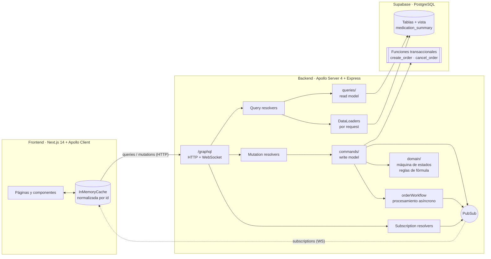

# Afirmative Pill: e-commerce farmacéutico con GraphQL y CQRS

Plataforma de venta de medicamentos construida para el **Taller 3 de Patrones de Arquitectura**. Toda la comunicación entre cliente y servidor pasa por un único endpoint GraphQL (queries, mutations y subscriptions), el backend separa el modelo de escritura del de lectura (CQRS) y los datos viven en Supabase (PostgreSQL).

- **Levantar el proyecto:** [INSTRUCCIONES.md](INSTRUCCIONES.md)
- **Qué se entrega y guion del video:** [ENTREGAS_FINALES.md](ENTREGAS_FINALES.md)
- **Historial de correcciones:** [CAMBIOS.md](CAMBIOS.md)
- **Plan técnico original:** [planning.md](planning.md)

---

## Qué hace

| Funcionalidad | Cómo se implementa |
| --- | --- |
| Catálogo con búsqueda, filtros y paginación | `useQuery(GET_MEDICATIONS)` sobre la vista condensada `MedicationSummary` |
| Ficha detallada del medicamento | `useQuery(GET_MEDICATION_DETAILS)` sobre el tipo completo `Medication` |
| Carrito | Estado local de React + `localStorage`; no toca el backend hasta el checkout |
| Checkout | `useMutation(CREATE_ORDER)`: cada error de negocio llega como un tipo de la union y se muestra con su mensaje |
| Medicamentos con fórmula médica | La orden exige un enlace a la fórmula; un químico farmacéutico (simulado) la valida o rechaza |
| Seguimiento en tiempo real | `useSubscription(ORDER_STATUS_CHANGED)`: la pantalla se actualiza sola, sin polling |
| Cancelación | Restaura el stock en la misma transacción |

---

## Arquitectura



- **Un solo endpoint:** `http://localhost:4000/graphql` atiende queries y mutations por HTTP y subscriptions por WebSocket (protocolo `graphql-ws`) en la misma ruta. El frontend no hace ninguna llamada REST.
  - El servidor también expone `GET /health`, pero solo para verificar que está vivo desde scripts (`npm run test:e2e`); el cliente no lo usa.
- **Monolito modular:** un solo proceso, con los módulos separados por responsabilidad dentro de `backend/src/`.

### Estructura

```text
backend/src/
├── schema/schema.graphql     # Contrato GraphQL completo
├── scalars.ts                # Escalares UUID y DateTime con validación
├── resolvers/                # Capa GraphQL: delega en commands/ o queries/
├── commands/                 # WRITE MODEL: validan invariantes y modifican estado
├── queries/                  # READ MODEL: proyecciones optimizadas para lectura
├── domain/                   # Reglas de negocio puras (estados, fórmula, workflow)
├── loaders/                  # DataLoaders (mitigación N+1)
├── datasources/              # Cliente Supabase y repositorio de órdenes
└── context.ts                # Contexto por request (usuario, loaders, pubsub)

frontend/
├── app/                      # Rutas: /, /catalog, /medication/[id], /cart, /orders, /orders/[id]
├── components/               # ApolloProvider, CartProvider, Header, tarjetas...
├── graphql/                  # Queries, mutations, subscriptions y fragmentos
└── lib/apolloClient.ts       # Split link HTTP/WS y políticas de caché

supabase/
├── migrations/               # Esquema, vista, funciones transaccionales
└── seed.sql                  # 10 categorías, 50 medicamentos, paciente demo
```

---

## Diseño del contrato GraphQL

El schema completo está en [`backend/src/schema/schema.graphql`](backend/src/schema/schema.graphql).

- **Vista condensada vs. ficha detallada.** `medications` devuelve `MedicationSummary` (lo mínimo para una tarjeta del catálogo) y `medication(id)` devuelve `Medication` completo, con indicaciones y contraindicaciones. Así se evita el over-fetching desde el diseño del schema, no solo por la selección de campos del cliente.
- **Errores tipados en vez de excepciones.** Cada mutation devuelve una `union` de un tipo de éxito y errores de negocio que implementan la interface `MutationError`. El cliente decide qué mostrar según el `__typename`:

  ```graphql
  union CreateOrderResult = CreateOrderSuccess | ValidationError
                          | InsufficientStockError | PrescriptionRequiredError
  ```

  `InsufficientStockError` trae `availableStock` y `requestedQuantity`; `PrescriptionRequiredError` trae los nombres de los medicamentos que exigen fórmula.
- **Escalares propios.** `UUID` rechaza identificadores mal formados antes de llegar a los resolvers, y `DateTime` normaliza las fechas a ISO 8601 en UTC.
- **Enums** para `OrderStatus` y `PrescriptionValidationStatus`, e **inputs** dedicados para cada comando.

---

## Justificación de CQRS

El dominio tiene dos cargas muy distintas:

- **Lectura:** el catálogo, que es mucha, repetitiva y tolera datos levemente desactualizados.
- **Escritura:** las órdenes, que son pocas pero deben proteger reglas de negocio estrictas (stock, fórmula médica, estados).

Mezclarlas obliga a que el modelo de lectura cargue con validaciones que no necesita y a que las escrituras lean proyecciones que pueden estar desactualizadas. Por eso se separan:

| | Write model (`commands/`) | Read model (`queries/`) |
| --- | --- | --- |
| Entrada | Mutations | Queries |
| Responsabilidad | Validar invariantes y cambiar el estado | Devolver proyecciones optimizadas |
| Fuente | Tablas, con filas bloqueadas dentro de una transacción | Vista `medication_summary` y proyecciones de orden |
| Resultado | Union de éxito o error tipado | Tipos de lectura (`MedicationSummary`, `Order`) |

**Regla que se respeta en el código:** los resolvers de `Mutation` solo llaman a `commands/` y los de `Query` solo llaman a `queries/`.

### Invariantes protegidas en el write model

1. **Fórmula médica.** Una orden con medicamentos formulados no se crea sin evidencia (`PrescriptionRequiredError`) y no se aprueba hasta que la evidencia se valida.
2. **Stock atómico.** La función SQL `create_order` bloquea las filas (`SELECT … FOR UPDATE`), vuelve a verificar el stock y lo descuenta en **una sola transacción**. Con 5 compras simultáneas contra un stock de 1, solo una tiene éxito (verificado en `npm run test:e2e`).
3. **Máquina de estados.** `PENDING_APPROVAL → APPROVED → DISPATCHED`, y `CANCELLED` solo desde los dos primeros estados. Está definida en [`domain/orderStatus.stateMachine.ts`](backend/src/domain/orderStatus.stateMachine.ts) y la función `cancel_order` la repite dentro de la transacción.
4. **Precio congelado.** El precio unitario se copia a `order_items` al momento de la compra.

---

## Justificación de la mitigación N+1

Un catálogo de 12 medicamentos con su categoría, resuelto de forma ingenua, hace 1 consulta para los medicamentos y 12 más para las categorías. En consultas anidadas (órdenes → ítems → medicamento → categoría) el problema se multiplica en cada nivel.

La solución es un **DataLoader por request**, creado en `context.ts`:

- Agrupa en una sola consulta todos los ids que se piden durante el mismo ciclo de ejecución (`WHERE id IN (...)`).
- Evita repetir ids dentro del mismo request.
- Se crea por request, nunca como singleton, para que la caché no se comparta entre usuarios.

Los field resolvers (`MedicationSummary.category`, `OrderItem.medication`…) usan el loader, **así que la categoría solo se consulta si el cliente la pide**. Estos son logs reales del servidor:

```text
# medications(limit: 12) { items { category { name } } }
[DataLoader] batching 6 category ids          ← 1 consulta en vez de 12

# medications(limit: 12) { items { commercialName } }
(ninguna consulta de categorías)               ← no se pidió, no se carga

# myOrders { items { medication { category { name } } } }
[DataLoader] batching 4 order items queries    ← 1 consulta por nivel,
[DataLoader] batching 3 medication ids            sin importar cuántas
[DataLoader] batching 3 category ids              órdenes haya
```

---

## Consistencia eventual

Crear una orden valida las invariantes y la guarda de inmediato en `PENDING_APPROVAL`. La aprobación ocurre **después**, de forma asíncrona ([`domain/orderWorkflow.ts`](backend/src/domain/orderWorkflow.ts)):

| Caso | Qué pasa |
| --- | --- |
| Sin fórmula | Se aprueba a los 5 s y se despacha 8 s después. |
| Con fórmula | Se revisa la evidencia (5 s). Si se valida, la orden se aprueba y se despacha. Si se rechaza, queda pendiente hasta que el paciente reenvíe la fórmula. |

- **Publicación:** cada cambio se publica en la subscription `orderStatusChanged`.
- **Qué ve el usuario mientras tanto:** el estado *Pendiente de aprobación*, con un aviso de que se está procesando; no se muestra como error ni como éxito final. Cuando llega el evento, Apollo actualiza la entrada normalizada `Order:<id>` en la caché y la pantalla cambia sola.
- **Las transiciones son condicionales** (`UPDATE … WHERE status = <esperado>`), así que una cancelación hecha a mitad del proceso nunca queda pisada.
- **Limitación conocida:** el procesamiento usa temporizadores en memoria, sin una cola real. Si el servidor se reinicia, las órdenes en curso quedan en su estado actual. Para el alcance del taller es aceptable, y en producción se reemplazaría por una cola de trabajos.

---

## Frontend y caché de Apollo

- **ApolloProvider** envuelve toda la app en `app/layout.tsx`.
- **Split link:** las subscriptions van por WebSocket y el resto por HTTP.
- **Actualización de la caché tras las mutations:**
  - `createOrder` escribe la orden nueva en la lista `myOrders` con `update()` y un fragmento compartido, sin volver a pedir la lista.
  - `cancelOrder` y `submitPrescriptionEvidence` actualizan la orden por su id normalizado.
- **Estados de carga:** cada pantalla maneja `loading`, `error` y `data` por separado.

## Autenticación

Se omitió a propósito: la rúbrica no la evalúa (ver `planning.md`, sección 12). Cada request se trata como el paciente demo, y el rol de administrador se simula con el header `x-demo-role: admin`, necesario para despachar manualmente con `confirmOrder`.

## Pruebas

```bash
cd backend
npm test            # 31 pruebas unitarias del dominio y los escalares (no necesita base de datos)
npm run test:e2e    # 28 escenarios contra el servidor real (necesita Supabase y el backend corriendo)
```

## Tecnologías

Apollo Server 4 · Express · graphql-ws · DataLoader · Supabase (PostgreSQL 17) · Next.js 14 (App Router) · Apollo Client 3 · Tailwind CSS · TypeScript · Jest

## Licencia

MIT
